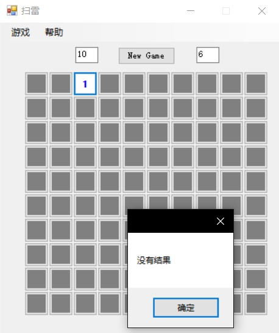
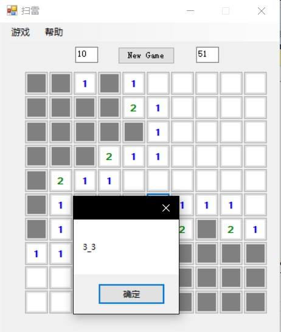
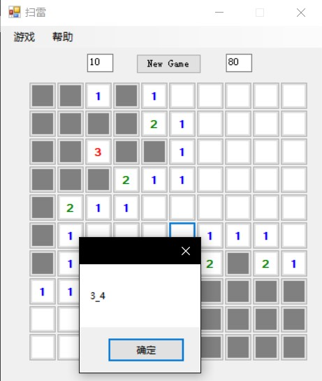

# Z3 Mine Sweeping
> Python 使用z3库进行扫雷  
> 优化计算速度，实现自动扫雷  
> 修复部分BUG  
> 部分情况无法得出解，需要手动点击  
> 运气好可以直接自动扫完  
> 如果无法运行， 重新生成项目  
> 如果能解决的情况都返回没有解， 检查Python命令和， demo.py 路径 
> 核心函数 308行 **private void python(string box_data)**   

## MineSwpeeing GUI借用地址
> [https://github.com/hxl9654/Mine-sweeping
](https://github.com/hxl9654/Mine-sweeping
)  
> 由于要实现自动扫雷，所以修改了部分代码  

## 开发环境
> windows10+vs2015+python2.7  
> [z3安装参考](https://www.jianshu.com/p/5530c6bb4a39)  

## 运行
在工程Form1.cs中， 在大概318行位置，在python函数中，更改python命令和python解决器的位置，例如如:  
```
python2.7 E:\\作业\\人工智能\\z3_mine_sweeping\\Python\\demo.py
```

开始运行,一个位置无法判断，继续手工扫雷  


可以判断,返回判断结果  


点击确认，自动点开结果，并返回下一个结果  
 